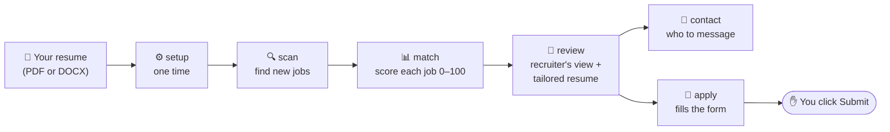

<div align="center">

# 🧭 jobpilot

**Your AI job-search copilot. Give it your resume, and it finds jobs, tells you which ones fit, and helps you apply.**

Works inside **Claude Code**, **Codex** and **Cursor**.

[](LICENSE)


</div>

---

## What is this?

Job hunting has a lot of repetitive work: checking career pages, reading long job posts, guessing whether you're a fit, rewriting your resume and filling in the same form fields again and again.

**jobpilot does the repetitive parts so you can focus on the decisions.** You give it your resume once. After that you use five short commands:

```
/jobpilot:scan       → "What's new on the job boards?"
/jobpilot:match      → "Which of these actually fit me?"
/jobpilot:review 12  → "How would a recruiter see me for job #12?"
/jobpilot:contact 12 → "Who should I reach out to, and what do I say?"
/jobpilot:apply 12   → "Fill in the application for me, and I'll hit Submit."
```

> [!IMPORTANT]
> **It never applies on your behalf.** It fills in the form and then stops. You review it and click Submit yourself.

---

## How it works



| Step | What it does | What you get |
|---|---|---|
| ⚙️ **setup** | Reads your resume, works out the roles, seniority and locations that suit you, and asks you to confirm | Your profile, plus a list of companies to watch |
| 🔍 **scan** | Checks the career pages of every company on your list (100+ to start with) | New jobs in your tracker, with the date posted and pay when listed. Reposted jobs are flagged, closed ones are marked closed, and you're told when your filters are too narrow |
| 📊 **match** | Reads each job post next to your profile and scores the fit from 0 to 100 | A score you can check line by line: which requirements you meet, with a quote from your profile for each one |
| 🧐 **review** | Reads your profile the way that job's recruiter would | Your strengths, honest gaps, missing keywords, rewritten bullet points, a check of which resume claims a recruiter could question, and an optional tailored resume PDF |
| 🤝 **contact** | Looks up the likely recruiter or hiring manager | Who they are, how sure it is, and a LinkedIn note under 300 characters |
| 📝 **apply** | Opens the real application form in a browser and fills it in from your profile | A filled form, a screenshot, and a list of the fields it couldn't answer. **It stops before Submit.** |

---

## Quick start (about 2 minutes)

### 1. Install the plugin

<details open>
<summary><b>Claude Code</b></summary>

```
/plugin marketplace add Krutarth22/jobpilot
/plugin install jobpilot@jobpilot
```
</details>

<details>
<summary><b>Codex</b></summary>

```
codex plugin marketplace add Krutarth22/jobpilot
codex plugin add jobpilot@jobpilot
```
</details>

<details>
<summary><b>Cursor</b></summary>

```
cursor-agent plugin marketplace add https://github.com/Krutarth22/jobpilot
```
Then open `/plugins` in an interactive Cursor session and install **jobpilot**.
</details>

<details>
<summary><b>Anything else (manual install)</b></summary>

```
git clone https://github.com/Krutarth22/jobpilot
cd jobpilot && ./install.sh
```
This links the skills into your CLI's skills folder.
</details>

### 2. Give it your resume

```
/jobpilot:setup ~/Downloads/my-resume.pdf
```

jobpilot reads your resume, suggests target roles and companies, and asks you to confirm them. That's the whole setup.

### 3. Find jobs

```
/jobpilot:scan
/jobpilot:match
```

You get a ranked list like this *(example)*:

```
#4  · 86 · Figma    · Manager, Software Engineering – Data Platform · posted 3 days ago  · data infra + team lead match, NYC ok
#1  · 78 · Ramp     · Tech Lead and Manager, Production Engineering · posted 2 weeks ago · strong backend, fintech domain new
#12 · 40 · Palantir · Forward Deployed Engineer                     · posted today       · capped: on-site only
```

Pick one and keep going with `/jobpilot:review 4`.

---

## What it's good at, and what it won't do

✅ **It will:**
- Scan company job boards **for free**. Scanning uses no AI tokens, only public job-board data.
- Give you **honest** fit scores. If a job is a poor match, it says so.
- **Show its work.** Every score comes with the reasons behind it, so you can disagree with a specific line instead of a mystery number.
- Rewrite your resume bullets for a specific job and show every change as *before → after*.
- Warn you when a posting has already closed, before you spend time on it.
- Get better over time. Tell it when a score feels wrong, and after about 10 corrections it suggests how to reweigh what matters to you. Nothing changes until you say yes.

🚫 **It won't:**
- **Make things up.** Everything it writes comes from your resume or from something you told it. If a job asks for a skill you don't have, it's listed as a gap, not added to your resume. A built-in fact check blocks any tailored resume that mentions a number, company or skill your profile doesn't back.
- **Submit anything.** No applications, messages or emails get sent without you.
- **Follow instructions hidden in job posts.** Text in a posting or form that tries to give the AI orders is flagged to you and ignored.

---

## How the score works

<details>
<summary><b>What goes into the 0–100 fit score?</b></summary>

The AI reads the job post and lists its requirements. For each one it says whether you **meet** it, **partly** meet it, or **don't**, and it must quote your profile as proof. A plain script, not the AI, then adds everything up, so the same checklist always gives the same score.

| Part | Weight | What it looks at |
|---|---|---|
| Skills | 35 | How many of the job's requirements you meet. Must-haves count double |
| Seniority | 25 | Your level and years of experience compared with what the job asks |
| Domain | 15 | Whether you've worked in this kind of product or industry |
| Location | 15 | Remote, hybrid or on-site, compared with what you want |
| Pay | 10 | The listed salary compared with your target (base pay is converted to an estimated total) |

Next to each score you'll see a short breakdown such as `S22/35 Sn20/25 D10/15 L15/15 C?/10`: the points earned out of each weight. A `?` means that information wasn't available, and it counts as neutral rather than zero.

**Deal-breakers** (on-site only when you want remote, sponsorship needed but not offered, a security clearance, a language you don't speak, or a big seniority mismatch) cap the score at 40, however good the rest looks.

**Two safety checks** catch the AI getting it wrong:
- A "meets it" answer without a real quote from your profile is downgraded to "partly".
- Every requirement must actually appear in the job post, and the score is compared with a simple keyword count. If either check fails, the job is re-checked.

</details>

<details>
<summary><b>How is the list ordered?</b></summary>

**Best matches first; among similar matches, newest first.**

Each job loses 1 point for every 5 days since it was posted, up to 10 points at most. A strong match that's been open for a while still ranks near the top; age only decides between jobs that fit about equally well. Jobs that have closed are marked closed by the scan rather than pushed down the list.

You can change this in `profile.md`:

```yaml
ranking: { days_per_point: 5, max_age_penalty: 10 }   # max_age_penalty: 0 turns it off
```
</details>

---

## Where your data lives

Everything stays on your computer, in one folder (`~/jobpilot/`) that plugin updates never touch:

```
~/jobpilot/
├── profile.md      ← your profile; every fact jobpilot uses comes from here
├── resume.pdf      ← your original resume
├── companies.yml   ← the companies to watch (edit it anytime)
├── jobs.csv        ← your tracker, which opens in Excel or Google Sheets
├── evals/          ← the reasons behind each job's score
├── claims.json     ← the resume claim check from review
└── out/            ← tailored resumes and review notes
```

Each job has one of three statuses: **new → applied → closed**. When you hear back, record how it went (interview, rejected, offer or no reply); jobpilot uses that to check whether its high scores really lead to interviews.

Want the folder somewhere else? Set `JOBPILOT_HOME=/path/you/like`.

---

## FAQ

<details>
<summary><b>Which job sites does it search?</b></summary>

Company career pages hosted on **Greenhouse**, **Lever** and **Ashby**, which together cover thousands of tech companies. It starts with 101 companies, including Stripe, Figma, Ramp and Palantir, all checked to be live, and adds more that fit your background during setup. You can add any company that uses one of these three systems to `companies.yml`.

LinkedIn, Indeed and Workday aren't supported yet.
</details>

<details>
<summary><b>Will a recruiter be able to check what's on my resume?</b></summary>

Some of it, yes, so `review` checks first. It breaks your resume into single claims (each job, date, degree, project and number) and checks that they agree with each other. With your permission, it also looks at your own links, such as GitHub or your website.

Each claim gets one of five plain labels:

| Label | Meaning |
|---|---|
| ✅ Matches the evidence | Something public backs it up |
| ⚪ Not enough evidence | Nothing contradicts it, but nothing public confirms it either |
| 🟡 Needs an explanation | A recruiter might ask about it, so have an answer ready |
| 🔴 Important details don't match | Something public says otherwise, such as different dates |
| ⚫ Unable to check | Private or confidential work, or no link to check |

"Not enough evidence" **does not mean false**. Most real work isn't public. For each flagged claim you get the question a recruiter might ask and a suggested fix: add a link, reword it, or prepare an answer. The results are private to you and never sent anywhere.
</details>

<details>
<summary><b>Does it cost anything?</b></summary>

The plugin is free and open source. `scan` uses **no AI tokens**. The other commands use your existing Claude, Codex or Cursor plan, like any other prompt.
</details>

<details>
<summary><b>Can it apply to 100 jobs for me automatically?</b></summary>

No, and that's on purpose. Mass-applying gets ignored by recruiters and can get your accounts flagged. jobpilot helps you send **fewer, better** applications. It does the typing, and you make the final call.
</details>

<details>
<summary><b>What do I need installed?</b></summary>

- **Node.js 18.17 or newer**. The first command installs everything else it needs.
- For tailored PDF resumes, run this once: `npx playwright install chromium`
- `apply` uses the Playwright browser tool that comes with the plugin.
</details>

<details>
<summary><b>The scan found nothing. What now?</b></summary>

Your title filter is probably too narrow. Open `companies.yml` and add more wordings under `title_filter.positive`. Use `+` to require words in any order: `manager + engineering` matches both *"Engineering Manager"* and *"Manager, Software Engineering"*. Or ask jobpilot: *"broaden my scan filters"*.

Every scan also lists **near misses**: job titles at your target locations that your filter skipped but that share words with the roles you want. It tells you exactly which wording to add, so you don't have to guess.
</details>

---

## Credits

- Parts of the job-board scanning, PDF rendering and closed-posting detection are adapted from [career-ops](https://github.com/santifer/career-ops) by santifer (MIT).
- The resume claim check in `review` comes from [resume-claim-verification](https://github.com/Krutarth22/resume-claim-verification), a companion project by the same author for the recruiter side.

**Coming later:** more job sources (LinkedIn, Workday), scheduled scans, and cover letters.

MIT licensed. See [LICENSE](LICENSE).
